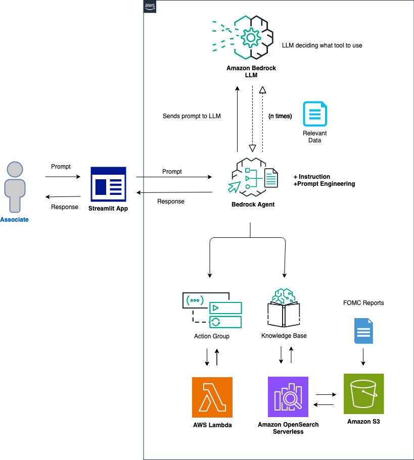

<div id="top"></div>

<!-- PROJECT SHIELDS -->
[](https://github.com/hashicorp/terraform/releases)
[](https://git-scm.com/)

<!-- PROJECT LOGO -->
<div align="center">
  <a href="https://github.com/your-organization/your-repo">
    
  </a>
  <p align="center">
    Terraform configuration for deploying a Bedrock-based AI assistant with integrated OpenSearch and S3 storage.
    <br />
    <a href="https://github.com/your-organization/your-repo/issues">Report Bug</a>
    ·
    <a href="https://github.com/your-organization/your-repo/issues">Request Feature</a>
  </p>
</div>

---

## Table of Contents

1. [Overview](#overview)
2. [Features](#features)
3. [Usage](#usage)
    - [Deploying the Bedrock Application](#deploying-the-bedrock-application)
    - [Lambda Configuration](#lambda-configuration)
4. [Requirements](#requirements)
5. [Inputs](#inputs)
6. [Outputs](#outputs)
7. [Maintainers](#maintainers)
8. [Authors](#authors)

## Overview

This Terraform project enables the deployment of an AI assistant powered by AWS Bedrock. The assistant integrates with OpenSearch for indexing and searching data, utilizes S3 for document storage, and provides seamless deployment of related infrastructure like Lambda functions and IAM roles. This setup includes secure IAM roles and policies to ensure safe and controlled access to resources.

## Features

- **AWS Lambda**: Handles API requests with flexible and scalable computing power.
- **OpenSearch**: Provides robust data indexing and search capabilities.
- **S3 Storage**: Stores documents and data sources securely.
- **IAM Roles & Policies**: Ensures secure access to all AWS resources.
- **AWS Bedrock**: Utilizes advanced AI models and pipelines for processing and analyzing data.

## Usage

### Deploying the Bedrock Application

```hcl
module "bedrock_application" {
  source = "./components/backend"

  providers = {
    aws = aws.virginia
  }

  # Define necessary variables
  agent_name          = "YourAgentName"
  kb_name             = "YourKnowledgeBaseName"
  oss_collection_name = "YourOpenSearchCollectionName"
  # Additional variables...
}
```

### Lambda Configuration

```hcl
resource "aws_lambda_function" "this_api" {
  filename = "${path.module}/lambda/this_api/index.py"
  # Additional configuration...
}
```
<!-- BEGINNING OF PRE-COMMIT-TERRAFORM DOCS HOOK -->
## Requirements

| Name | Version |
|------|---------|
| <a name="requirement_terraform"></a> [terraform](#requirement\_terraform) | ~> 1.5 |
| <a name="requirement_aws"></a> [aws](#requirement\_aws) | ~> 5.48 |
| <a name="requirement_opensearch"></a> [opensearch](#requirement\_opensearch) | = 2.2.0 |

## Providers

No providers.

## Modules

| Name | Source | Version |
|------|--------|---------|
| <a name="module_backend"></a> [backend](#module\_backend) | ./components/backend | n/a |

## Resources

No resources.

## Inputs

| Name | Description | Type | Default | Required |
|------|-------------|------|---------|:--------:|
| <a name="input_action_group_name"></a> [action\_group\_name](#input\_action\_group\_name) | The action group name. | `string` | `"ThisAPI"` | no |
| <a name="input_agent_model_id"></a> [agent\_model\_id](#input\_agent\_model\_id) | The ID of the foundational model used by the agent. | `string` | `"anthropic.claude-3-haiku-20240307-v1:0"` | no |
| <a name="input_agent_name"></a> [agent\_name](#input\_agent\_name) | The agent name. | `string` | `"ThisAssistant"` | no |
| <a name="input_kb_model_id"></a> [kb\_model\_id](#input\_kb\_model\_id) | The ID of the foundational model used by the knowledge base. | `string` | `"amazon.titan-embed-text-v1"` | no |
| <a name="input_kb_name"></a> [kb\_name](#input\_kb\_name) | The knowledge base name. | `string` | `"ThisKB"` | no |
| <a name="input_oss_collection_name"></a> [oss\_collection\_name](#input\_oss\_collection\_name) | The name of the OSS collection for the knowledge base. | `string` | `"bedrock-knowledge-base-this-kb"` | no |
| <a name="input_s3_bucket_name_prefix"></a> [s3\_bucket\_name\_prefix](#input\_s3\_bucket\_name\_prefix) | The name prefix of the S3 bucket for the data source of the knowledge base. | `string` | `"this-kb"` | no |

## Outputs

| Name | Description |
|------|-------------|
| <a name="output_agent_id"></a> [agent\_id](#output\_agent\_id) | The ID of the Bedrock agent. |
| <a name="output_knowledge_base_arn"></a> [knowledge\_base\_arn](#output\_knowledge\_base\_arn) | The ARN of the Bedrock knowledge base. |
| <a name="output_knowledge_base_id"></a> [knowledge\_base\_id](#output\_knowledge\_base\_id) | The ID of the Bedrock knowledge base. |
| <a name="output_lambda_function_arn"></a> [lambda\_function\_arn](#output\_lambda\_function\_arn) | The ARN of the Lambda function. |
| <a name="output_lambda_function_name"></a> [lambda\_function\_name](#output\_lambda\_function\_name) | The name of the Lambda function. |
| <a name="output_oss_collection_arn"></a> [oss\_collection\_arn](#output\_oss\_collection\_arn) | The ARN of the OpenSearch collection. |
| <a name="output_oss_collection_id"></a> [oss\_collection\_id](#output\_oss\_collection\_id) | The ID of the OpenSearch collection. |
| <a name="output_s3_bucket_arn"></a> [s3\_bucket\_arn](#output\_s3\_bucket\_arn) | The ARN of the S3 bucket used for the knowledge base. |
| <a name="output_s3_bucket_id"></a> [s3\_bucket\_id](#output\_s3\_bucket\_id) | The ID of the S3 bucket used for the knowledge base. |
<!-- END OF PRE-COMMIT-TERRAFORM DOCS HOOK -->

<p align="right">
  <a href="#top" style="text-decoration: none; background-color: #4CAF50; color: white; padding: 6px 10px; border-radius: 5px;">⬆ Back to Top</a>
</p>

## Maintainers

This module is maintained by [Luis Patino](https://github.com/orgs/your-organization/teams/your-team).

## Authors

- **Luis Felipe Patino** - [luisfpl](https://github.com/luisfpl)

<p align="right">
  <a href="#top" style="text-decoration: none; background-color: #4CAF50; color: white; padding: 6px 10px; border-radius: 5px;">⬆ Back to Top</a>
</p>
